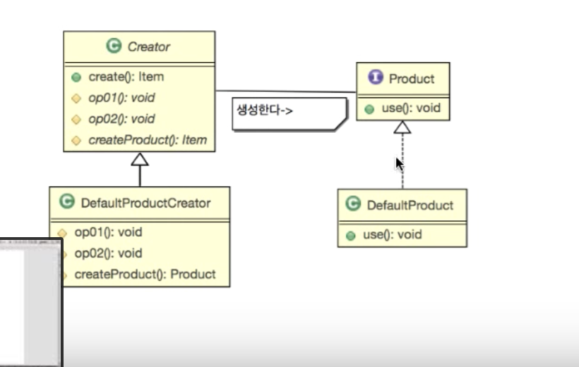

## Java Design Pattern


## 팩토리 메소드 패턴 (Factory Method Pattern)

> 팩토리 메소드 패턴에서 ***템플릿 메소드 패턴***이 사용된다.
>
> 객체를 만들어내는 부분을 서브 클래스Sub-Class에 위임하는 패턴.


*기본설계*

'`create()`라는 함수가 여러개로 나뉘어 질 수 있다.'는 점이 템플릿 메소드와 같은 방식, 그래서 `create()`가 팩토리 메소드라고 볼 수 있다.





*Creator.java*

```java
public abstract class Creator {

		// Application.java에서 itemName을 파라미터로 받아 팩토리 메서드에서 객체를 생성하고 반환.
    public Item create(String itemName){

        // step1: 데이터 베이스에서 아이템을 호출
        init(itemName);
        // step2: 바탕으로 아이템을 생성
        Item item = createItem(itemName);
        // step3: 생성 로그를 찍는 함수
        end(itemName);

        return item;

    }

    abstract protected String end(String itemName);
    abstract protected String init(String itemName);
    // 아이템을 생성하는 알고리즘
    abstract protected Item createItem(String itemName);

}
```