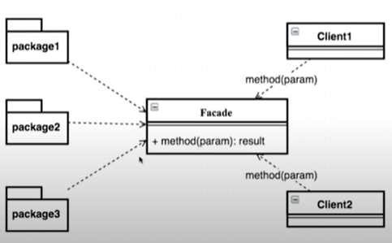

## Java Design Pattern


## 퍼사드 패턴 (Facade Pattern)

복잡한 과정을 **간단하게** 표현하는 퍼사드 패턴을 이해한다.




다양한 패키지에서 여러가지 클래스를 제공받는다.

클라이언트들이 어떠한 프로세스를 진행할 수 있도록 제공해주는 패턴이다.


위 그림에서 package1과 package2에 해당하는

HelpSystem01, HelpSystem02

```java
package com.FacadePattern;

// defualt 접근제한자
class HelpSystem01 {
    public HelpSystem01() {
        System.out.println(getClass().getName());
    }

    public void process() {
        System.out.println(getClass().getSimpleName());
    }
}
```

```java
package com.FacadePattern;

class HelpSystem02 {
    public HelpSystem02() {
        System.out.println(getClass().getName());
    }

    public void process() {
        System.out.println(getClass().getSimpleName());
    }
}
```

Facade.java

Facade 클래스를 통해 HelpSystem01, HelpSystem02를 실행한다.


```java
package com.FacadePattern;

public class Facade { // Facade

    private HelpSystem01 helpSystem01;
    private HelpSystem02 helpSystem02;

    public Facade() {
        helpSystem01 = new HelpSystem01();
        helpSystem02 = new HelpSystem02();
    }

    public void process() {
        helpSystem01.process();
        helpSystem02.process();
    }

}
```

Application.java

Client에 해당한다.

바로 시스템들을 사용할 수 있게 하는 패턴이 된다.

```java
package com.FacadePattern;

public class Application { // Client
    public static void main(String[] args) {
        Facade facade = new Facade();
        facade.process();
    }
}
```