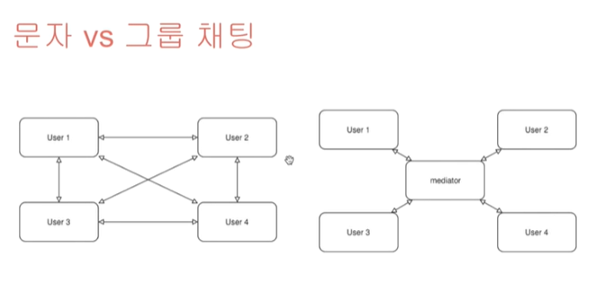
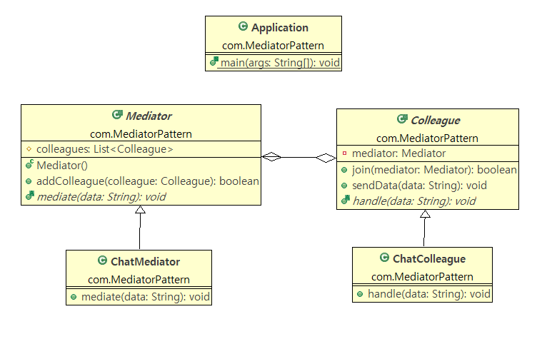

## Java Design Pattern


## 중재자패턴 (Mediator Pattern)

**M:N 관계**를 **1:1**로 변경하기

미디에이터 패턴을 통해 **복잡한** 관계를 **간단한** 관계로 구현한다.



abstract Mediator - 객체를 담는 그릇(list, map ...)

abstract  Colleague(객체) - 어떤 Mediator인지 필드로 가지고 있음




```java
package com.MediatorPattern;

public class Application {
	public static void main(String[] args) {
		Mediator mediator = new ChatMediator();
		
		Colleague colleague1 = new ChatColleague();
		Colleague colleague2 = new ChatColleague();
		Colleague colleague3 = new ChatColleague();
		
		colleague1.join(mediator);
		colleague2.join(mediator);
		colleague3.join(mediator);
		
		colleague1.sendData("AAA");
		colleague2.sendData("BBB");
		colleague3.sendData("CCC");
	}

}
```


```java
package com.MediatorPattern;

import java.util.ArrayList;
import java.util.List;

public abstract class Mediator {
	
	protected List<Colleague> colleagues; // colleague의 리스트를 가지고 있어야 중재할 대상을 얻는다.
	
	public Mediator() {
		colleagues = new ArrayList<Colleague>();
	}
	
	public boolean addColleague(Colleague colleague) {
		
		if (colleagues != null) {
			return colleagues.add(colleague); // return true
		} else {
			return false;
		}
	}
	
	public abstract void mediate(String data);
	
}

```


```java
package com.MediatorPattern;

public class ChatMediator extends Mediator{

	@Override
	public void mediate(String data) {
		System.out.println(data);
		for (Colleague colleague : colleagues) {
			// 중재 가능성이 있는 정보가 존재
			colleague.handle(data);
		}
	}
}
```


```java
package com.MediatorPattern;

public abstract class Colleague {
	
	private Mediator mediator; // 어떤 mediator에 속했는가
	
	public boolean join(Mediator mediator) {
		
		if (mediator == null) { // null 이라면 false return
			return false;
		}
		else {
			this.mediator = mediator;
			return mediator.addColleague(this);
		}
	}
	
	public void sendData(String data) {
		if(mediator != null) {
			mediator.mediate(data);
		}
	}
	
	abstract public void handle(String data);	
	
}

```


```java
package com.MediatorPattern;

public class ChatColleague extends Colleague{

	@Override
	public void handle(String data) {
		System.out.println(this);
	}
}
```


> 전체 colleague에게 데이터가 전송되는 방식

`sendData()` -> `mediate()` -> `handle()`