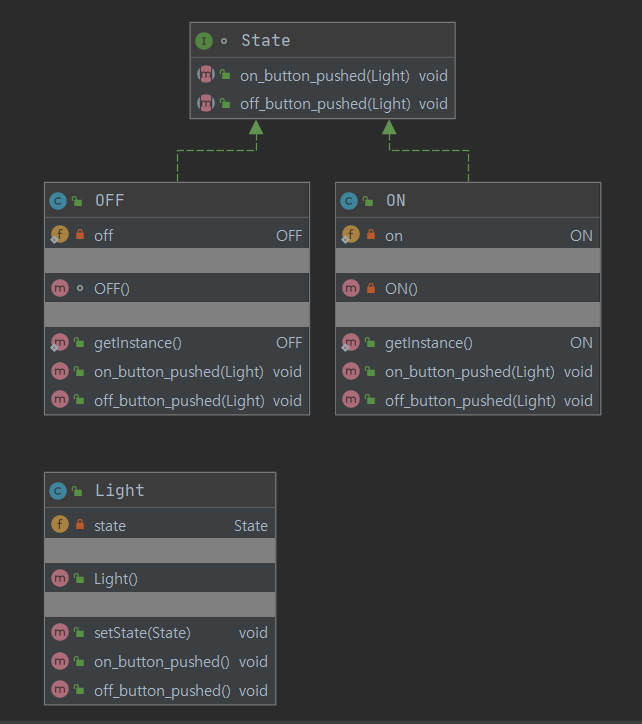

## Java Design Pattern


## 스테이트 패턴 (State Pattern)

> 상태란?
>
> 객체가 시스템에 존재하는 동안, 즉 객체의 라이프 타임 동안 객체가 가질 수 있는 어떤 조건이나 상황
>
> 즉, 객체가 어떤 상황에 있는 동안 어떤 액티비티등을 수행하거나 특정 이벤트가 발생하기를 기다리는 것


**어떤 행위를 수행할 때 상태에 행위를 수행하도록 위임한다.**

그래서 스테이트 패턴에서는 시스템의 각 상태를 클래스로 분리해 표현하고,

각 클래스에서 수행하는 행위들을 메서드로 구현한다.

그리고 이러한 상태들을 외부로부터 캡슐화 하기 위해 **인터페이스**를 만들어 시스템의 각 상태를 나타내는 클래스로하여금 실체화하게한다.





```java
package com.StatePattern;

interface State {

    public void on_button_pushed(Light light);
    public void off_button_pushed(Light light);

}
```

```java
package com.StatePattern;

public class OFF implements State{
    // 싱글턴 패턴 사용
    private static OFF off = new OFF();
    OFF(){}

    public static OFF getInstance() {
        return off;
    }
    @Override
    public void on_button_pushed(Light light) {
        System.out.println("Light ON");
        light.setState(ON.getInstance()); // 싱글턴 패턴 사용
    }

    @Override
    public void off_button_pushed(Light light) {
        System.out.println("반응 없음");
    }
}
```

```java
package com.StatePattern;

public class ON implements State{
    // 싱글턴 패턴 사용
    private static ON on = new ON();
    private ON(){}

    public static ON getInstance() {
        return on;
    }

    @Override
    public void on_button_pushed(Light light) {
        System.out.println("반응 없음");
    }

    @Override
    public void off_button_pushed(Light light) {
        System.out.println("Light OFF");
        light.setState(OFF.getInstance()); // 싱글턴 패턴 사용
    }
}
```

```java
package com.StatePattern;

public class Light {

    private State state; // 인터페이스의 객체를 생성

    public Light() {
        state = new OFF(); // 처음에는 off 상태이다.
    }

    public void setState(State state) {
        this.state = state;
    }

    public void on_button_pushed() {
        state.on_button_pushed(this); // 자기자신(this)를 넣는다.
    }

    public void off_button_pushed() {
        state.off_button_pushed(this); // 자기자신(this)를 넣는다.
    }

}
```

```java
package com.StatePattern;

public class LightMain {

    public static void main(String[] args) {
        Light light = new Light();
        light.on_button_pushed();
    }
}
```