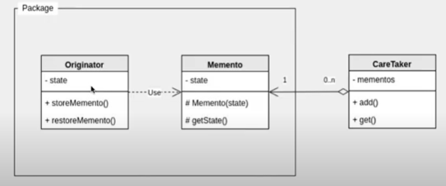

## Java Design Pattern

## 메멘토 패턴 (Memento Method Pattern)

> 상태 저장하기

즉, 이전 상태를 저장한 **객체**를 이용하여 변경된 상태를 **복구**한다.

*protected 사용

`Originator` - 현재 상태를 저장하는 클래스

`Memento` - Originator의 상태를 저장하는 클래스

`CareTaker` - Memento를 관리해주는 관리자 역할을 하는 클래스

