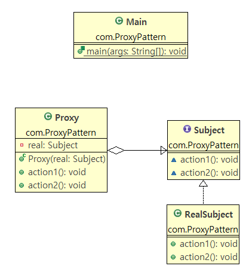

# Java Design Pattern


# 프록시 패턴  (Proxy Pattern)

대리인 내세우기

프록시 - 대리인

프록시 패턴을 통해 `작업을 나눠서` 구현




```java
package com.ProxyPattern;

public class Main {

	public static void main(String[] args) {
		
		Subject real = new RealSubject();
		
		Subject proxy1 = new Proxy(real);
		Subject proxy2 = new Proxy(real);
		
		proxy1.action1();
		proxy2.action1();
		
		proxy1.action2();
		proxy2.action2();
		
	}
	
}

```


```java
package com.ProxyPattern;

public interface Subject {
	
	// more resource
	void action1();
	
	// less #
	void action2();
	
}

```


```java
package com.ProxyPattern;

public class Proxy implements Subject{
	
	private Subject real;
	
	public Proxy(Subject real) {
		this.real = real;
	}
	
	@Override
	public void action1() {
		// 간단한 업무는 proxy가 한다.
		System.out.println("간단한 업무 by proxy");
	}

	@Override
	public void action2() {
		this.real.action2();
	}

	
}

```


```java
package com.ProxyPattern;

public class RealSubject implements Subject {

	@Override
	public void action1() {
		System.out.println("간단한 업무 by realSubject");
	}

	@Override
	public void action2() {
		System.out.println("복잡한 업무  by realSubject");
	}

}

```

